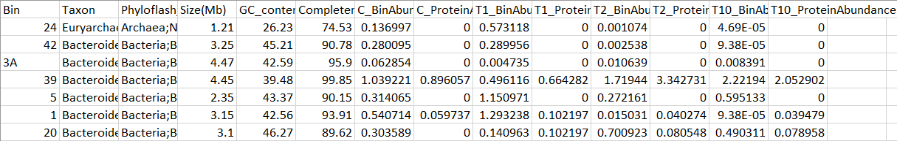

# Bubble Plot for relative abundance and protein expression

### Saved the excel file as .csv and called Abundance_GP



### Set working directory and loaded libraries 

```
setwd("/Maryam/papers/R_scripts_for_Figures")
library(dplyr)
library(tidyr)
library(ggplot2)
```

### Uploaded my data to R
```
Abundance_GP <- read.table("Abundance_GP.csv", header = TRUE, sep = ",")
```
R does not like numbers in the headers so it puts an X next to them. I changed the names so header doesn't start with a number.

### Changed my data structure from wide to long format

```
Abundance_GP_long <- gather(Abundance_GP , Condition , Abundance, 7:14)
```


### Removed zero

```
Abundance_GP_long_nozero <- filter(Abundance_GP_long, Abundance > 0)
```

### Split the condition column into two columns
```
Abundance_GP_long_nozero_split <- separate(Abundance_GP_long_nozero, Condition, c("treatments","Bin_Protein"), sep = "_")
```

### Combine two columns 
```
Abundance_GP_long_nozero_split$names <- paste(Abundance_GP_long_nozero_split$Bin, "_", Abundance_GP_long_nozero_split$Phyloflash_Taxon)
```


### Set cutoff value
set minimum vaules at 0.001, anything below that will be plotted at 0.001
```
cutoff = 0.001
Abundance_GP_long_nozero_split_below001 <- filter(Abundance_GP_long_nozero_split, Abundance < cutoff)
Abundance_GP_long_nozero_split_below001$Abundance_ADJ = cutoff
Abundance_GP_long_nozero_split_abv001 <- filter(Abundance_GP_long_nozero_split, Abundance > cutoff)
Abundance_GP_long_nozero_split_abv001$Abundance_ADJ = Abundance_GP_long_nozero_split_abv001$Abundance
Abundance_GP_long_nozero_split_adj2 <- bind_rows(Abundance_GP_long_nozero_split_abv001, Abundance_GP_long_nozero_split_below001)
```

### Set orders for axis 

```
name_order <- c("56", "7A", "41", "17", "57", "23", "5A", "50", "7", "35", "46", "40", "8A", "58", "52", "12", "34", "29", "42", "20", "6A", "4A", "3A", "53", "10A", "5", "1", "39", "24")

Treatment_order <- c("C", "T1", "T2", "T10")
```

### Plot the data
```
plot<- ggplot(Abundance_GP_long_nozero_split_adj2, aes(x=treatments , y=Bin))

plot + geom_point(aes(size= Abundance_ADJ, colour= treatments)) +
  scale_y_discrete(limits = name_order) +
  scale_x_discrete(limits = Treatment_order) +
  scale_size(range = c(3,14), breaks = c(0.001, 0.01, 0.1, 1, 10), labels = c("0.001", "0.01", "0.1", "1", "10")) + 
  facet_grid(.~Bin_Protein)+
  theme(text = element_text(size = 14), panel.background = element_rect(fill = "white"), panel.grid.major = element_line(colour = "grey90")) 

```


  